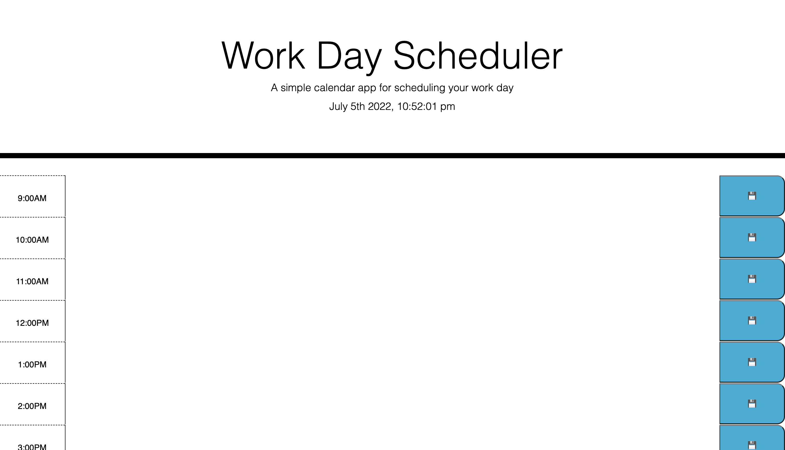

# Workday-Schedule

# Table of Contents 

1. [Description](#description)
2. [Visuals](#Visuals)
3. [Deployment](#deployment)

## Description

In this assignment I was tasked with creating a responsive calendar. Firstly, We are to deploy the date, time, and seconds using the set interval method.

Next, the task was to save text in the textArea space that gets the item from local storage upon refresh.

Lastly, depending on the time of day the calendar boxes will either be red, green, or gray.

## Visuals
 

## Deployment

[link to live webiste](https://ju1williams.github.io/Workday-Schedule/)
[link to github repo](https://github.com/Ju1Williams/Workday-Schedule.git)